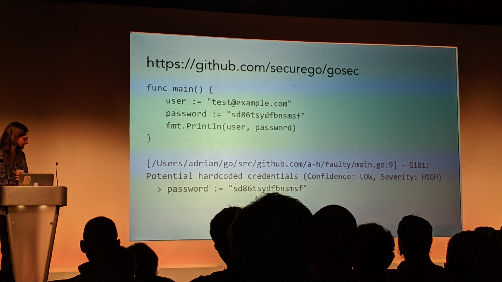
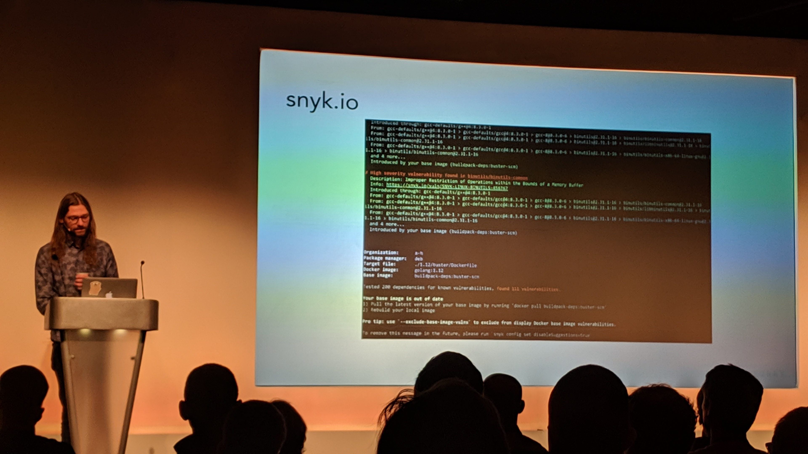
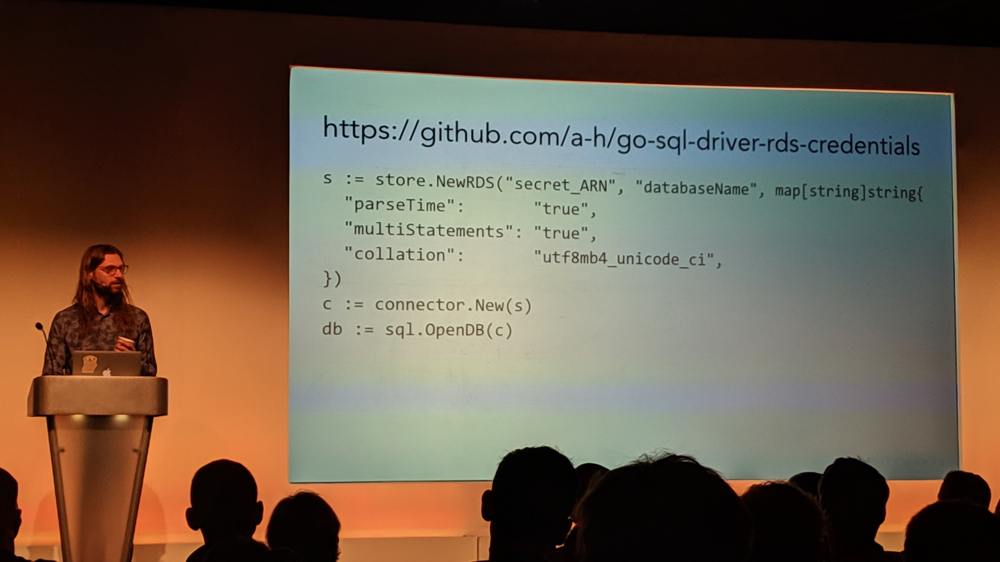
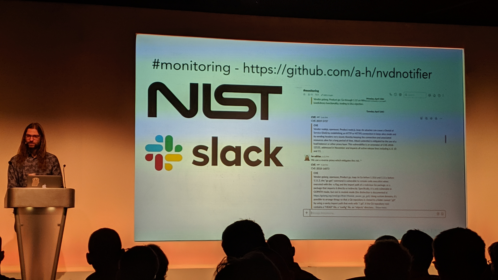
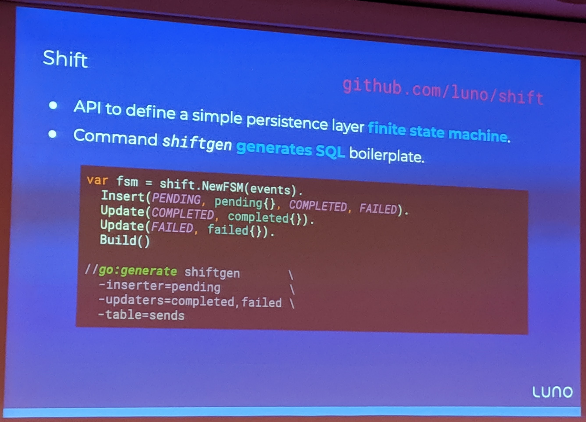
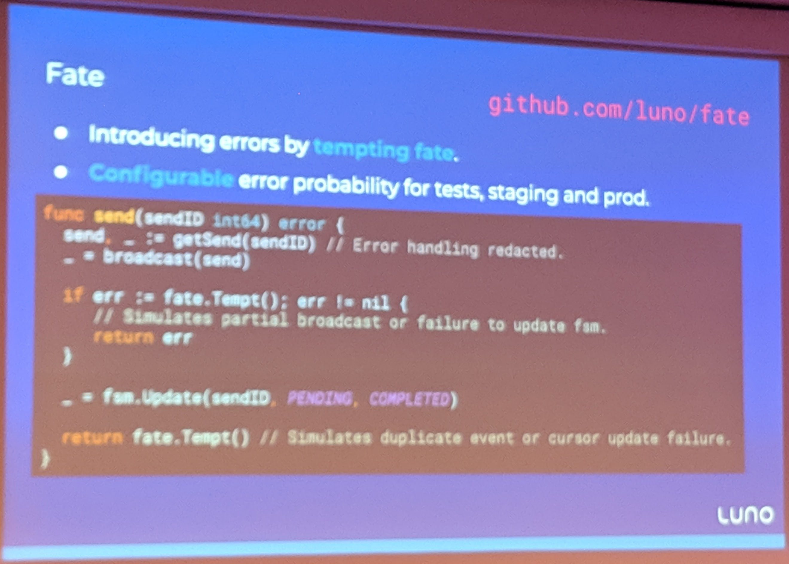

# GopherCon UK 2019

## Finding dependable Go packages (Julie Qiu @JQiu25)

https://speakerdeck.com/julieqiu/finding-dependable-go-packages

This talk was about how to find and choose Go packages to use in your projects. Julie suggested a three stage approach.

- Discovery - how to find the package?
  - Social media?
  - Google search?
- Evaluation - how to evaluate the package?
  - Does the package have a licence?
  - Is the package popular?
    - Downloads
    - Stars
    - Forks
    - Watchers
    - Contributors
    - Dependents
  - How good is the quality of the code in the package?
    - Documentation (godoc.org)
    - Tests (goreportcard.com)
    - Bugs (staticcheck.io)
  - What is the upkeep of the package?
    - Maintainer Activity
    - Commit History
    - Issue Tracker
  - How many indirect dependencies does the package have?
    - What if one of those is deleted?
    - Use godoc.org to see the dependencies
- Maintenance - how well is the package maintained?
  - Stay up to date with releases of the package
  - Contribute to the project

I thought we might be able to pull together some kind of checklist that includes some of the above items, in PR checklists for our Go projects.

At the end of the talk Julie announced that the Go community are working on a new discovery site to help with the above process. The site will display documentation for Go packages with version support and provide features that help developers discover and evaluate Go packages or modules. This should be launched at the end of the year. See https://golang.org/s/discovery-updates

## A Go Security Journey (Adrian Hesketh @AdrianHesketh)

This talk was about how to ensure the Go code you create is secure. There were a lot of very interesting tools that Adrian rattled through, which I mostly captured in photographic form! Adrian also handily supplied a link of links at the end of the talk - https://gist.github.com/a-h/e5558b35a1e24cc6950406e45ef0d646

### algnhsa

This is a tool that run existing Go web applications on AWS Lambda/API Gateway without changing the existing HTTP handlers.

https://github.com/akrylysov/algnhsa

### Golang Security Checker

This tool inspects the source code for security problems, such as hardcoded passwords. Could be added to our CI pipelines.

https://github.com/securego/gosec

### quay

This tool scans container images for security vulnerabilities.

https://quay.io/

### snyk

This tool scans for dependency security vulnerabilities.

https://snyk.io/

### go-sql-driver-rds-credentials

This tool will automatically rotate MySQL credentials when using AWS Secrets Manager.

https://github.com/a-h/go-sql-driver-rds-credentials

### National Vulnerability Database Notifier

Notifies on Slack when a new vulnerability is added to the https://nvd.nist.gov database.

https://github.com/a-h/nvdnotifier

### Disable caching and sniffing

These are settings that are often missed, that can be disabled for extra security.

https://gist.github.com/a-h/c0d85863621a67e980f7fad44e645fbc

### HTTP Strict Transport Security

This is a tool that redirects users from HTTP to HTTPS and adds the HSTS header.

https://github.com/a-h/hsts

Also consider https://github.com/unrolled/secure

### OWASP Zed Attack Proxy

Free security tool to help automatically find security vulnerabilities in web applications.

https://www.owasp.org/index.php/OWASP_Zed_Attack_Proxy_Project

## Improving Dependencies for Everyone (Aaron Schlesinger @arschles)

This was a talk about the Athens project, which is a proxy for Go modules. We could run an instance of Athens at our organisation that would allow us to download Go modules when sites such as GitHub go offline. You could even run a local instance to allow you to download Go modules when working offline.

https://docs.gomods.io/

Link to the demo Aaron showed - https://github.com/aarons-talks/2019-08-23-GopherCon-UK

## Dr. Jekyll and Mr. Hyde: Embracing the Dual Nature of State (Corver Roos)

This talk was about state machines utilising mutable state and immutable events. This interested me as I have written a finate state machine in PHP for the CRM! The state that is mutable, i.e. it can be changed, and imutable events, i.e. the event is fixed, are records of how the state was changed.

Corver mentioned a lot of interesting Go libraries.

## Shift

Shift provides the SQL persistence layer for a simple "finite state machine" domain model.

https://github.com/luno/shift

## Reflex

Reflex provides an API for building distributed event notification streams.

https://github.com/luno/reflex

## Tempting Fate

This is a great library that allows you to "design for failure"! It allows you introduce random errors into your Go source code, thus testing whether the code can correctly recover from such errors. Similar to the Netflix [Chaos Monkey](https://netflix.github.io/chaosmonkey/).

https://github.com/luno/fate
